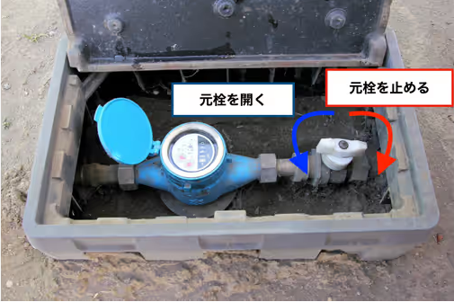

# 🏠 住宅設備マニュアル

> *快適な住まいづくりのためのガイドブック*

このマニュアルでは、住宅の設備や修繕に関する方法を詳しく解説しています。DIY愛好家から初心者まで、誰でも実践できる内容です。

---

## 📑 目次

| セクション | 内容 | 難易度 |
|:----------|:-----|:-----:|
| [🚽 トイレの設置方法](toilet-installation.html) | トイレの交換・設置の手順 | ★★☆ |
| [🪵 フローリングの張替え](flooring-replacement.html) | フローリング材の選び方と施工方法 | ★★★ |
| [🔨 DIY初心者におすすめの大工道具まとめ](kougu.html) | 初心者が揃えるべき基本工具リスト | ★☆☆ |
| [⚙️ その他の設備について](other-equipment.md) | 照明・水回り・収納などの設備情報 | ★★☆ |

---

## 💡 このマニュアルについて

```
このマニュアルは住宅設備の基本的な設置・修繕方法をまとめたものです。
日常生活で起こりうるちょっとした不具合から、本格的なDIYプロジェクトまでカバーしています。
専門的な工事が必要な場合は、専門業者にご相談ください。
```

---

## 🏆 プロジェクトタイトル



*あなたの住まいを、もっと快適に、もっと自分らしく*

---

### ✨ DIYのコツと豆知識

* **計画を立てる**: 作業前に必要な材料と工具をリストアップしましょう
* **安全第一**: 適切な保護具（手袋、ゴーグルなど）を着用しましょう
* **急がば回れ**: 丁寧に作業することで、結果的に時間の節約になります
* **分からないことは調べる**: このマニュアルや信頼できる情報源で確認しましょう

---

<div style="text-align: center; font-style: italic; color: #888;">
住まいのことならお任せください
</div>

<!-- スタイル適用例 -->
<link rel="stylesheet" href="assets/css/custom.css">
